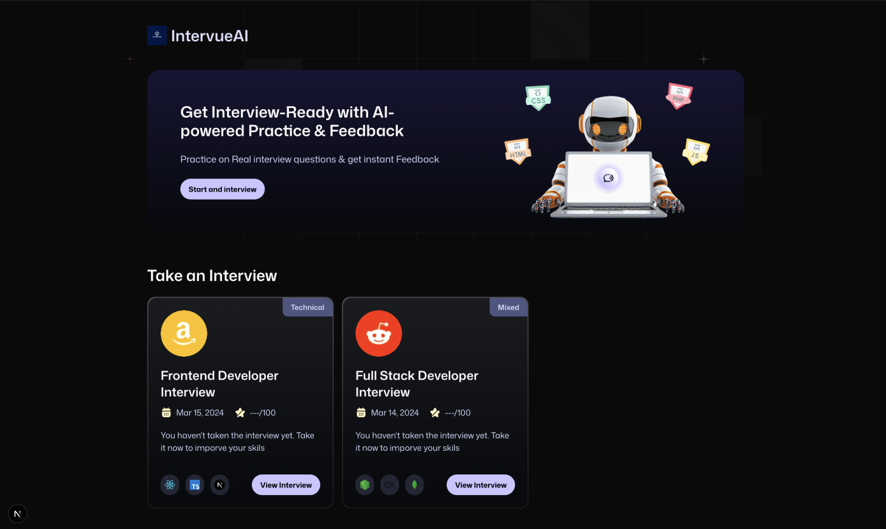
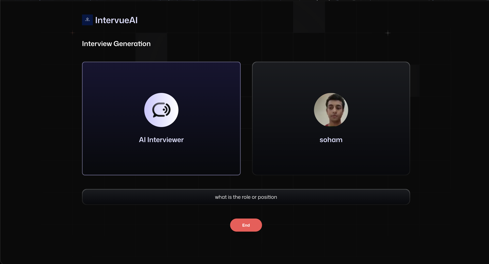

<div align="center">
  
  
  <br />
  <br />

  # IntervueAI

  **Get Interview-Ready with AI-powered Practice & Feedback**
  <br />
  Practice on real interview questions and receive instant, actionable feedback.
</div>

<br />

## About the Project

IntervueAI is an intelligent interview preparation platform designed to help candidates ace their interviews. By leveraging the power of AI, users can simulate real-world interview scenarios, answer industry-standard questions, and receive comprehensive feedback to improve their performance.

### Key Features

- **AI-Powered Practice:** Conduct mock interviews with an AI assistant.
- **Instant Feedback:** Receive real-time evaluations and suggestions to refine your answers.
- **Track Your Progress:** Keep a record of your past interviews and see how you improve over time.
- **Modern UI/UX:** A clean, responsive, and accessible interface built with Next.js and Tailwind CSS.
- **Dark/Light Mode:** Seamlessly switch between themes based on your preference.

---

## Screenshots

<div align="center">
  
</div>

---

## Tech Stack

IntervueAI is built using modern web technologies to ensure high performance and scalability:

- **Framework:** [Next.js 15](https://nextjs.org/) (React)
- **Styling:** [Tailwind CSS](https://tailwindcss.com/)
- **UI Components:** [Radix UI](https://www.radix-ui.com/) & Shadcn UI
- **AI Integrations:** [Vapi AI](https://vapi.ai/) & [AI SDK Google](https://sdk.vercel.ai/providers/ai-sdk-providers/google-generative-ai)
- **Backend/Database:** [Firebase](https://firebase.google.com/)
- **Forms & Validation:** [React Hook Form](https://react-hook-form.com/) & [Zod](https://zod.dev/)
- **Icons:** [Lucide React](https://lucide.dev/)

---

## Getting Started

Follow these steps to set up the project locally on your machine.

### Prerequisites

Make sure you have Node.js installed. We recommend using `npm`, `yarn`, or `pnpm`.

### Installation

- **Clone the repository:**
   ```bash
   git clone https://github.com/your-username/IntervueAI.git
   cd IntervueAI
   ```

- **Install dependencies:**
   ```bash
   npm install
   # or
   yarn install
   # or
   pnpm install
   ```

- **Set up environment variables:**
   Create a `.env.local` file in the root of the project and add your required keys (Firebase, AI SDKs, etc.):
   ```env
   # Example environment variables
   NEXT_PUBLIC_FIREBASE_API_KEY=your_api_key
   NEXT_PUBLIC_FIREBASE_AUTH_DOMAIN=your_auth_domain
   NEXT_PUBLIC_FIREBASE_PROJECT_ID=your_project_id
   VAPI_PUBLIC_KEY=your_vapi_key
   GOOGLE_AI_API_KEY=your_google_ai_key
   ```

- **Run the development server:**
   ```bash
   npm run dev
   # or
   yarn dev
   # or
   pnpm dev
   ```

- **Open the app:**
   Open [http://localhost:3000](http://localhost:3000) with your browser to see the application running.

---

## Contributing

Contributions, issues, and feature requests are welcome! Feel free to check the [issues page](https://github.com/your-username/IntervueAI/issues).

- Fork the project.
- Create your feature branch: `git checkout -b feature/my-new-feature`
- Commit your changes: `git commit -m 'Add some feature'`
- Push to the branch: `git push origin feature/my-new-feature`
- Submit a pull request.

---

## License

This project is licensed under the [MIT License](LICENSE).
